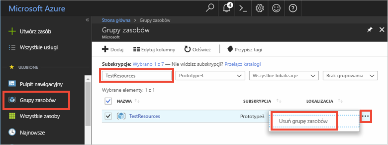

Jeśli zamierzasz przejść do kolejnego zalecanego artykułu, możesz zachować już utworzone zasoby i użyć ich ponownie.

W przeciwnym razie możesz usunąć zasoby platformy Azure utworzone w tym artykule, aby uniknąć naliczania opłat. 

> [!IMPORTANT]
> Usunięcie grupy zasobów jest nieodwracalne. Grupa zasobów oraz wszystkie zawarte w niej zasoby zostaną trwale usunięte. Uważaj, aby nie usunąć przypadkowo niewłaściwych zasobów lub grupy zasobów. Jeśli usługa IoT Hub została utworzona wewnątrz istniejącej grupy zasobów zawierającej zasoby, które chcesz zachować, zamiast usuwać całą grupę zasobów, usuń tylko zasób usługi IoT Hub.
>

Aby usunąć grupę zasobów na podstawie nazwy:

1. Zaloguj się do witryny [Azure Portal](https://portal.azure.com) i wybierz pozycję **Grupy zasobów**.

2. W polach tekstowych **Filtruj według nazwy** wpisz nazwę grupy zasobów zawierającej Centrum IoT Hub. 

3. Po prawej stronie grupy zasobów na liście wyników wybierz polecenie **...** **Usuń grupę zasobów**.

    

4. Zobaczysz prośbę o potwierdzenie usunięcia grupy zasobów. Wpisz ponownie nazwę grupy zasobów, aby potwierdzić, a następnie wybierz pozycję **Usuń**. Po krótkim czasie grupa zasobów i wszystkie zawarte w niej zasoby zostaną usunięte.