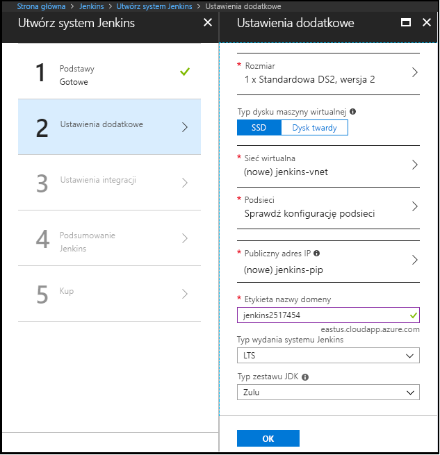

1. W przeglądarce otwórz [obraz serwera Jenkins z witryny Azure Marketplace](https://azuremarketplace.microsoft.com/marketplace/apps/azure-oss.jenkins?tab=Overview).

1. Wybierz pozycję **POBIERZ TERAZ**.

    

1. Po zapoznaniu się z cenami i warunkami wybierz pozycję **Kontynuuj**.

    

1. Wybierz pozycję **Utwórz**, aby skonfigurować serwer Jenkins w witrynie Azure Portal. 

    

1. Na karcie **Basics** (Ustawienia podstawowe) określ następujące wartości:

   - **Name** (Nazwa) — Wprowadź wartość `Jenkins`.
   - **User name** (Nazwa użytkownika) — Wprowadź nazwę użytkownika, która będzie stosowana podczas logowania się do maszyny wirtualnej, na której będzie działać serwer Jenkins. Nazwa użytkownika musi spełniać [konkretne wymagania](/azure/virtual-machines/linux/faq#what-are-the-username-requirements-when-creating-a-vm).
   - **Authentication type** (Typ uwierzytelniania) — Wybierz pozycję **SSH public key** (Klucz publiczny SSH).
   - **SSH public key** (Klucz publiczny SSH) — Skopiuj i wklej klucz publiczny RSA w formacie jednowierszowym (począwszy od ciągu `ssh-rsa`) lub w wielowierszowym formacie PEM. Klucze SSH można wygenerować, używając narzędzia ssh-keygen w systemach Linux i macOS lub narzędzia PuTTYGen w systemie Windows. Aby uzyskać więcej informacji na temat kluczy SSH i platformy Azure, zobacz artykuł [Jak używać kluczy protokołu SSH w systemie Windows na platformie Azure](/azure/virtual-machines/linux/ssh-from-windows).
   - **Subscription** (Subskrypcja) — Wybierz subskrypcję platformy Azure, w ramach której chcesz zainstalować serwer Jenkins.
   - **Resource group** (Grupa zasobów) — Wybierz pozycję **Create new** (Utwórz nową), a następnie wprowadź nazwę grupy zasobów, która służy jako kontener logiczny dla kolekcji zasobów tworzących instalację serwera Jenkins.
   - **Location** (Lokalizacja) — Wybierz pozycję **East US** (Wschodnie stany USA).

     

1. Wybierz pozycję **OK**, aby przejść na kartę **Additional Settings** (Ustawienia dodatkowe). 

1. Na karcie **Additional Settings** (Ustawienia dodatkowe) określ następujące wartości:

   - **Size** (Rozmiar) — Wybierz odpowiednią opcję rozmiaru dla swojej maszyny wirtualnej serwera Jenkins.
   - **VM disk type** (Typ dysku maszyny wirtualnej) — Wybierz opcję HDD (dysk twardy) lub SSD (dysk półprzewodnikowy), aby wskazać, jaki typ dysku pamięci masowej jest dozwolony dla maszyny wirtualnej serwera Jenkins.
   - **Virtual network** (Sieć wirtualna) — (Opcjonalnie) Wybierz pozycję **Virtual network** (Sieć wirtualna), aby zmodyfikować ustawienia domyślne.
   - **Subnets** (Podsieci) — Wybierz opcję **Subnets** (Podsieci), sprawdź informacje i wybierz przycisk **OK**.
   - **Public IP address** (Publiczny adres IP) — Domyślna nazwa adresu IP to nazwa serwera Jenkins określona na poprzedniej stronie z sufiksem -IP. Możesz wybrać tę opcję, aby zmienić wartość domyślną.
   - **Domain name label** (Etykieta nazwy domeny) — Określ wartość dla w pełni kwalifikowanego adresu URL maszyny wirtualnej serwera Jenkins.
   - **Jenkins release type** (Typ wersji serwera Jenkins) — Wybierz żądany typ wersji spośród opcji: `LTS`, `Weekly build` i `Azure Verified`. Opcje `LTS` i `Weekly build` zostały objaśnione w artykule [Jenkins LTS Release Line](https://jenkins.io/download/lts/) (Linia wydań LTS serwera Jenkins). Opcja `Azure Verified` odnosi się do [wersji LTS serwera Jenkins](https://jenkins.io/download/lts/), która została zweryfikowana pod kątem działania na platformie Azure. 
   - **JDK Type** (Typ zestawu JDK) — Zestaw JDK do zainstalowania. Wartość domyślna to przetestowane przez Zulu, certyfikowane kompilacje OpenJDK.

     

1. Wybierz przycisk **OK**, aby przejść do karty **Integration Settings** (Ustawienia integracji).

1. Na karcie **Integration Settings** (Ustawienia integracji) określ następujące wartości:

    - **Service Principal** (Jednostka usługi) — Jednostka usługi jest dodawana do serwera Jenkins jako poświadczenie na potrzeby uwierzytelniania na platformie Azure. Opcja `Auto` oznacza, że jednostka zostanie utworzona za pomocą funkcji MSI (Managed Service Identity). Opcja `Manual` oznacza, że jednostka powinna zostać utworzona przez Ciebie. 
        - **Application ID** (Identyfikator aplikacji) i **Secret** (Klucz tajny) — Jeśli wybierzesz opcję `Manual` w polu **Service Principal** (Jednostka usługi), musisz określić wartości `Application ID` i `Secret` dla swojej jednostki usługi. W przypadku [tworzenia jednostki usługi](/cli/azure/create-an-azure-service-principal-azure-cli) pamiętaj, że domyślna rola to **Contributor** (Współautor), która jest wystarczająca do pracy z zasobami platformy Azure.
    - **Enable Cloud Agents** (Włącz agentów chmurowych) — Określ domyślny szablon chmurowy dla agentów, gdzie wartość `ACI` odnosi się do wystąpienia kontenera platformy Azure, a wartość `VM` odnosi się do maszyn wirtualnych. Możesz również określić wartość `No`, jeśli nie chcesz włączać agenta chmurowego.

1. Wybierz przycisk **OK**, aby przejść do karty **Summary** (Podsumowanie).

1. Po wyświetleniu karty **Summary** (Podsumowanie) wprowadzone informacje są weryfikowane. Gdy zostanie wyświetlony komunikat **Validation passed** (Weryfikacja pomyślna) (w górnej części karty), wybierz opcję **OK**. 

     

1. Gdy zostanie wyświetlona karta **Create** (Tworzenie), wybierz pozycję **Create** (Utwórz), aby utworzyć maszynę wirtualną serwera Jenkins. Gdy serwer będzie gotowy, w witrynie Azure Portal zostanie wyświetlone powiadomienie.

     
