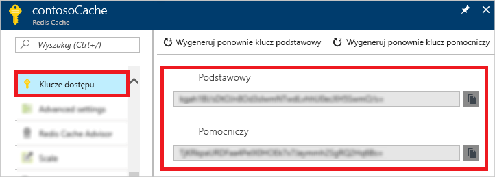
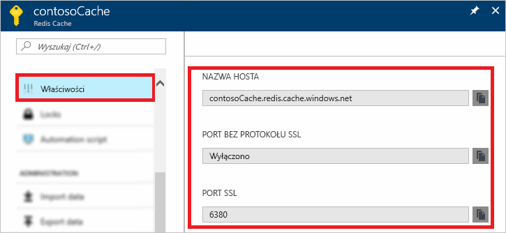

### Pobieranie nazwy hosta, portów i kluczy dostępu z witryny Azure portal

Aby połączyć się z pamięcią podręczną platformy Azure dla wystąpienia Redis, klienci pamięci podręcznej potrzebują nazwy hosta, portów i klucza pamięci podręcznej. Niektórzy klienci mogą odwoływać się do tych elementów przy użyciu nieco innych nazw. Nazwę hosta, porty i klucze można uzyskać z [witryny Azure portal](https://portal.azure.com).

- Aby uzyskać klucze dostępu, z lewej strony pamięci podręcznej wybierz pozycję **Klawisze dostępu**. 
  
  

- Aby uzyskać nazwę hosta i porty, z lewej strony pamięci podręcznej nawigacji wybierz **polecenie Właściwości**. Nazwa hosta jest * \<nazwą DNS formularza>.redis.cache.windows.net*.

  

