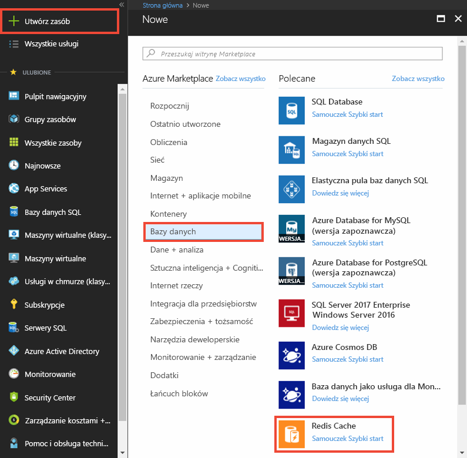
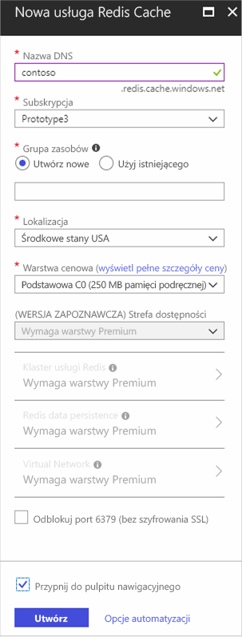
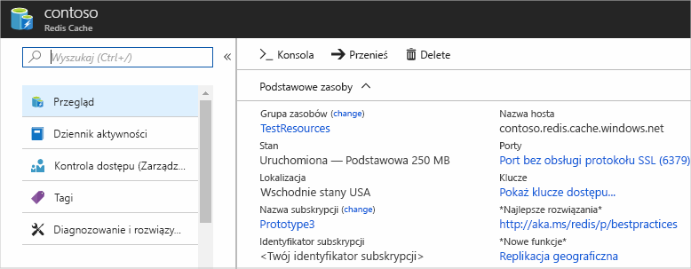

1. Aby utworzyć pamięć podręczną, najpierw zaloguj się w [witrynie Azure Portal](https://portal.azure.com). Następnie wybierz pozycję **Utwórz zasób** > **Bazy danych** > **Azure Cache for Redis**.

    

2. W polu **Nowa pamięć podręczna Azure Cache for Redis** skonfiguruj ustawienia nowej pamięci podręcznej.

    | Ustawienie      | Sugerowana wartość  | Opis |
    | ------------ |  ------- | -------------------------------------------------- |
    | **Nazwa DNS** | Nazwa unikatowa w skali globalnej | Nazwa pamięci podręcznej. Musi być ciągiem od 1 do 63 znaków i może zawierać tylko cyfry, litery oraz znak `-`. Na początku ani na końcu nazwy pamięci podręcznej nie może występować znak `-`, a następujące po sobie znaki `-` nie są prawidłowe.  | 
    | **Subskrypcja** | Twoja subskrypcja | Subskrypcja, w ramach której jest tworzone nowe wystąpienie pamięci podręcznej Azure Cache for Redis. | 
    | **Grupa zasobów** |  *TestResources* | Nazwa nowej grupy zasobów, w której ma zostać utworzona pamięć podręczna. Dzięki wprowadzeniu wszystkich zasobów dla aplikacji do grupy można nimi zarządzać jednocześnie. Na przykład usunięcie grupy zasobów powoduje usunięcie wszystkich zasobów skojarzonych z aplikacją. | 
    | **Location** | East US | Wybierz [region](https://azure.microsoft.com/regions/) w pobliżu innych usług, które będą korzystać z pamięci podręcznej. |
    | **[Warstwa cenowa](https://azure.microsoft.com/pricing/details/cache/)** |  Podstawowa C0 (250 MB pamięci podręcznej) |  Warstwa cenowa decyduje o rozmiarze, wydajności i funkcjach dostępnych dla pamięci podręcznej. Aby uzyskać więcej informacji, zobacz [Omówienie pamięci podręcznej Azure Cache for Redis](../articles/azure-cache-for-redis/cache-overview.md). |
    | **Przypnij do pulpitu nawigacyjnego** |  Wybrane | Przypnij nową pamięć podręczną do pulpitu nawigacyjnego, aby było łatwo ją znaleźć. |

     

3. Po skonfigurowaniu nowych ustawień pamięci podręcznej wybierz pozycję **Utwórz**. 

    Tworzenie pamięci podręcznej może zająć kilka minut. Stan operacji można sprawdzić, monitorując postęp na pulpicie nawigacyjnym. Po utworzeniu pamięci podręcznej ma ona stan **Uruchomiona** i jest gotowa do użycia.

    

