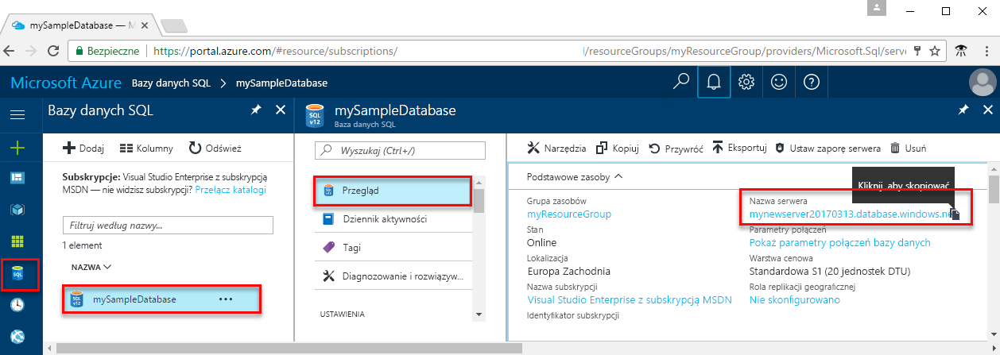

<!-- sql-database-connect-query-prerequisites-server-connection-info-includes.md 

## Get SQL server connection information
-->

Uzyskaj parametry połączenia potrzebne do nawiązania połączenia z bazą danych Azure SQL. W następnych procedurach będą potrzebne w pełni kwalifikowana nazwa serwera, nazwa bazy danych i informacje logowania.

1. Zaloguj się w witrynie [Azure Portal](https://portal.azure.com/).

1. Wybierz pozycję **Bazy danych SQL** z menu po lewej stronie, a następnie kliknij bazę danych na stronie **Bazy danych SQL**.

1. Na stronie **Przegląd** bazy danych sprawdź w pełni kwalifikowaną nazwę serwera obok pola **Nazwa serwera**. Aby skopiować nazwę serwera, umieść na niej wskaźnik myszy i wybierz ikonę **Kopiuj**.  

Jeśli zapomnisz swoje informacje logowania, wybierz nazwę serwera, aby otworzyć stronę **serwera SQL**. W tym miejscu możesz wyświetlić nazwę **administratora serwera** i wybrać opcję **Resetuj hasło** w razie potrzeby.