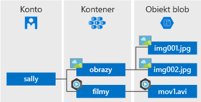

Azure Blob Storage to rozwiązanie do magazynowania obiektów w chmurze firmy Microsoft. Usługa Blob Storage jest zoptymalizowana pod kątem przechowywania olbrzymich ilości danych bez struktury, takich jak dane tekstowe lub binarne.

Usługa Blob Storage to idealne rozwiązanie w następujących przypadkach:

* Obsługiwanie obrazów i dokumentów bezpośrednio w przeglądarce.
* Przechowywanie plików do dostępu rozproszonego.
* Przesyłanie strumieniowe audio i wideo.
* Zapisywanie plików dziennika.
* Zapisywanie danych w celu tworzenia kopii zapasowych, przywracania, odzyskiwania po awarii i archiwizowania.
* Przechowywanie danych w celu analizy w usłudze lokalnej lub hostowanej na platformie Azure.

Użytkownicy lub aplikacje klienckie mogą uzyskiwać dostęp do obiektów usługi Blob Storage za pomocą protokołu HTTP lub HTTPS&mdash;z dowolnego miejsca na świecie,&mdash;używając adresów URL, [interfejsu API REST usługi Azure Storage](https://docs.microsoft.com/rest/api/storageservices/blob-service-rest-api), programu [Azure PowerShell](https://docs.microsoft.com/powershell/module/azure.storage), [interfejsu wiersza polecenia platformy Azure](https://docs.microsoft.com/cli/azure/storage) lub biblioteki klienta usługi Azure Storage. Biblioteki klienta magazynu są dostępne dla różnych języków, w tym [.NET](https://docs.microsoft.com/dotnet/api/overview/azure/storage/client), [Java](https://docs.microsoft.com/java/api/overview/azure/storage/client), [Node.js](http://azure.github.io/azure-storage-node), [Python](https://docs.microsoft.com/python/azure/), [PHP](http://azure.github.io/azure-storage-php/) i [Ruby](http://azure.github.io/azure-storage-ruby).

## Pojęcia dotyczące usługi Blob

Usługa Blob Storage udostępnia trzy rodzaje zasobów: konto magazynu, kontenery na koncie i obiekty blob w kontenerach. Na poniższym diagramie przedstawiono relacje między tymi zasobami.

### Konto magazynu

Dostęp do obiektów danych w usłudze Azure Storage odbywa się za pośrednictwem konta magazynu. Aby uzyskać więcej informacji, zobacz [Omówienie konta magazynu platformy Azure](../articles/storage/common/storage-account-overview.md?toc=%2fazure%2fstorage%2fblobs%2ftoc.json).

### Kontener

Kontener porządkuje zestaw obiektów blob, pełniąc funkcję podobną do folderu w systemie plików. Wszystkie obiekty blob znajdują się w określonym kontenerze. Konto magazynu może zawierać nieograniczoną liczbę kontenerów, a każdy kontener może zawierać nieograniczoną liczbę obiektów blob. 

  > [!NOTE]
  > Wszystkie litery w nazwie kontenera muszą być małymi literami.

### Obiekt blob
 
W usłudze Azure Storage dostępne są trzy typy obiektów blob&mdash;blokowe obiekty blob, uzupełnialne obiekty blob i [stronicowe obiekty blob](../articles/storage/blobs/storage-blob-pageblob-overview.md) (używane w przypadku plików VHD).

* Blokowe obiekty blob mogą zawierać dane tekstowe i binarne o rozmiarze do około 4,7 TB. Blokowe obiekty blob składają się z bloków danych, którymi można zarządzać indywidualnie.
* Uzupełnialne obiekty blob również składają się z bloków, podobnie jak blokowe obiekty blob, lecz są zoptymalizowane pod kątem operacji dołączania. Uzupełnialne obiekty blob doskonale sprawdzają się w sytuacjach takich jak zapisywanie danych dzienników z maszyn wirtualnych.
* Stronicowe obiekty blob umożliwiają przechowywanie plików o dostępie swobodnym o rozmiarze do 8 TB. Stronicowe obiekty blob są używane do przechowywania plików VHD wspierających maszyny wirtualne.

Wszystkie obiekty blob znajdują się w określonym kontenerze. Kontener przypomina folder w systemie plików. Można dodatkowo porządkować obiekty blob w katalogach wirtualnych i przechodzić między nimi tak jak w systemie plików. 

Jednak czasami duże zestawy danych i ograniczenia sieci uniemożliwiają przewodowe przekazywanie danych do usług Blob Storage. Możesz użyć usługi [Azure Data Box Disk](../articles/databox/data-box-disk-overview.md), aby poprosić o dyski SSD od firmy Microsoft. Możesz następnie skopiować dane na te dyski i odesłać je do firmy Microsoft do przekazania do usługi Blob Storage.

Aby dowiedzieć się, jak wyeksportować duże ilości danych z konta magazynu, zobacz [Przesyłanie danych do usługi Blob Storage za pomocą usługi Microsoft Azure Import/Export](../articles/storage/common/storage-import-export-service.md).
  
Aby uzyskać szczegółowe informacje o nazewnictwie kontenerów i obiektów blob, zobacz temat [Nazewnictwo i odwołania do kontenerów, obiektów blob i metadanych](/rest/api/storageservices/Naming-and-Referencing-Containers--Blobs--and-Metadata).
