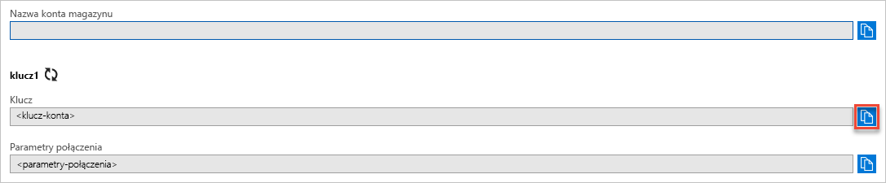

## Kopiowanie poświadczeń z witryny Azure Portal

Aplikacja przykładowa musi autoryzować dostęp do konta magazynu. Podaj aplikacji swoje poświadczenia konta magazynu w postaci parametrów połączenia. Aby wyświetlić swoje poświadczenia konta magazynu:

1. Zaloguj się w witrynie [Azure Portal](https://portal.azure.com).
2. Odszukaj konto magazynu.
3. W sekcji **Ustawienia** omówienia kont magazynu wybierz pozycję **Klucze dostępu**. Zostaną wyświetlone parametry połączenia i klucze dostępu do konta.
4. Zanotuj nazwę konta magazynu, która będzie potrzebna w celu autoryzacji.   
5. Znajdź wartość **klucza** w obszarze **Klucz1**, a następnie wybierz pozycję **Kopiuj** , aby skopiować klucz konta.

    
