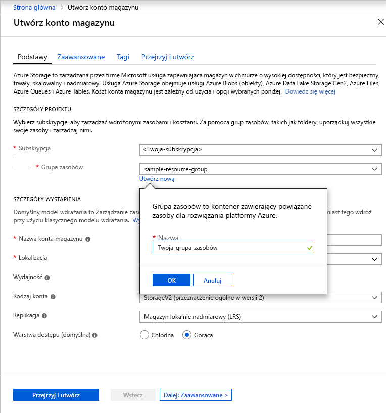

Aby utworzyć konto magazynu ogólnego przeznaczenia w wersji 2 w witrynie Azure Portal, wykonaj następujące kroki:

1. W witrynie Azure Portal wybierz pozycję **Wszystkie usługi**. Na liście zasobów wpisz wartość **Konta magazynu**. Po rozpoczęciu pisania zawartość listy jest filtrowana w oparciu o wpisywane dane. Wybierz pozycję **Konta usługi Storage**.
1. W oknie **Konta magazynu**, które zostanie wyświetlone, wybierz pozycję **Dodaj**.
1. Wybierz subskrypcję, w ramach której chcesz utworzyć konto magazynu.
1. W polu **Grupa zasobów** wybierz pozycję **Utwórz nową**. Wprowadź nazwę nowej grupy zasobów, jak pokazano na poniższej ilustracji.

    

1. Następnie wprowadź nazwę konta magazynu. Wybrana nazwa musi być unikatowa w obrębie całej platformy Azure. Ponadto nazwa musi mieć długość od 3 do 24 znaków i może zawierać tylko cyfry i małe litery.
1. Wybierz lokalizację konta magazynu lub użyj lokalizacji domyślnej.
1. Pozostaw poniższe pola ustawione na wartości domyślne:

   |Pole  |Wartość  |
   |---------|---------|
   |Model wdrażania     |Resource Manager         |
   |Wydajność     |Standardowa (Standard)         |
   |Rodzaj konta     |StorageV2 (ogólnego przeznaczenia wersja 2)         |
   |Replikacja     |Magazyn lokalnie nadmiarowy (LRS)         |
   |Warstwa dostępu     |Gorąca         |

1. Wybierz pozycję **Przejrzyj i utwórz**, aby przejrzeć ustawienia konta magazynu i utworzyć konto.
1. Wybierz pozycję **Utwórz**.

Aby uzyskać więcej informacji na temat typów kont magazynu i innych ustawień konta magazynu, zobacz [Azure storage account overview (Omówienie kont usługi Azure Storage)](https://docs.microsoft.com/azure/storage/common/storage-account-overview). Więcej informacji na temat grup zasobów znajduje się w temacie [Omówienie usługi Azure Resource Manager](https://docs.microsoft.com/azure/azure-resource-manager/resource-group-overview). 
